# The Poster Shop e-commerce store

Welcome to the Shop Store, a Django-based e-commerce website specialized in selling vintage and retro posters online. With an extensive collection of nostalgic artworks, our platform aims to bring the charm of the past to your modern living space. 

The live version of this app is located [here](https://poster-shop-4968517d882f.herokuapp.com). 

## Table Of Contents:
1. [Design](#design)
    * [User Stories](#user-stories)
    * [Wireframes](#wireframes)
    * [Agile Methodology](#agile-methodology)
    * [Database Diagram](#database-diagram)
    * [Features](#features)
    * [Future Features](#future-features)
    * [Technologies Used](#technologies-used)
    * [Testing](#testing)
    * [Deployment](#deployment)

# User Stories

User stories are a great way to define the functionality and features of a ecommerce site from the perspective of the end users. Here are some user stories for the e-commerce site Poster Shop:

## Site User

- As a site user, I would like to view a list of available posters so that I can select one or more to purchase.

- As a site user, I would like to click on an individual poster so that I can see its image in full, title, price, category, year, description, and artist. 

- As a site user, I would like to search for a poster using different search criterea such as title or artist name as well as other parametrs so that I can easily find the poster I want to purchase.

- As a site user I would like to sort posters by price, name, and category so that I can easily find the poster that I like or need.

- As a site user I would like to add, view, update and delete poster in the shopping basket so that I can review or manage my shopping basket before proceeding to checkout.

- As a site user I would like to view the total amount of posters in my shopping basket so that I can know how many posters were added in the basket at all times.

- As a site user I would like to provide the necessary billing and delivery information so that I can purchase poster and view an order confirmation after checkout to verify all the information from my purchase is accurate.

- As a site user I would like to receive an email confirmation after the purchase so that I can keep records of my transactions.

- As a site user, I have the ability to create an account, so I can log in and log out using personalized credentials. Additionally, I can request assistance in recovering my password if I happen to forget it.

- As a site user I would like to create/manage my personal profile on the site so that I can view/update my profile, view my order history and save my billing information.

- As a site user I would like to contact the site admin in case I need have any queries.

- As a site user I would like to subscribe to the site newsletters so that I can receive news, special offers and general information related to the store.

- As a site user I would like to see information about shipping and returns in addition to general site information such as about us, terms of use, privacy policy by navigating to corresponding pages.

## Site Admin

- As a site admin, I should be able to add, view, update and delete posters so that I can manage posters on the site.

- As a site admin, I should be able to view who signed up for the site newsletters.

# Wireframes 

Wireframes provide a visual representation of the site's layout and structure, making it easier to conceptualize and understand the overall design and functionality. Wireframe mockups were created using MockFlow - online wireframing and product design tool. 

    
Start Page
  

  

    
Posters List Page
  
    
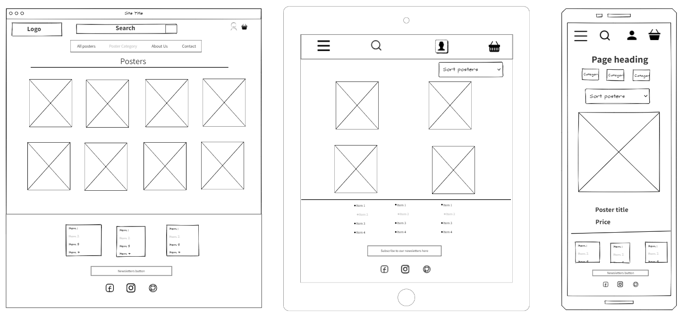  

  

    
Poster Detail Page
  
    
  

  

    
Checkout Page
  
    
  

 
  

    
Shopping Bag Page
  
    
  

    
About Us Page
  
    
  

    
Sign Up Page
  
    
  

    
Sign In Page
  
    
  

    
Newsletter Signup Page
  
    
  

## Features

Vintage & Retro Collection: Browse through a curated selection of vintage and retro posters from various eras.
User Authentication: Register an account or log in securely to manage your orders and preferences.
Shopping Cart: Add posters to your cart for easy checkout.
Secure Checkout: Process payments securely using integrated payment gateways.
Order Management: View and manage your orders through the user dashboard.
Admin Panel: Admins can manage products, orders, and users through an intuitive admin interface.
Search & Filter: Easily find posters by searching or filtering based on categories, eras, artists, and more.
Responsive Design: Enjoy a seamless browsing experience across devices with our responsive design.

- Site Navagation 
  - The site havigation is added in the header of the site and consists of three sections - the main menu bar centered horizontally, the members area, and search bar. The search field is placed in the center of page just above the main menu bar. The members area is placed in the top right corner of the page for optimizing visibility, accessibility, and user experience, contributing to a smoother and more intuitive browsing experience for users.

  - The site logo was placed on the top left side of the navigation bar which optimizes brand recognition, navigation flow, consistency, and space efficiency, contributing to a positive user experience and reinforcing the website's identity. The Logo image is linked to the home page, clicking on it will bring the user back to the home page from any other page.

  - The site basket is located in the top right corner of the navigation bar. Placing the site basket in the top right corner of the navigation bar maximizes visibility, accessibility, and usability, while also maintaining consistency with established navigation patterns and user expectations.

  - When viewed on smaller screens, the navigation bar transforms into a compact hamburger menu, represented by a simple icon consisting of three horizontal lines. Clicking on this icon reveals a dropdown menu with all navigation options, providing users with a streamlined and mobile-friendly navigation experience.

  - On smaller screens the search is collapced into a search icon clicking on which reveals full search bar in the dropdown.

  - Links in the navigation menu have visual cues, with the hover over color change. On About us and Contact pages different color or the menue item indicates current page location.

 - Navigation links include filtering by different parametres such as By Price, By Category, and All Posters. 

   

- Home Page

   - The Home page is the main entry page to the site. It intuitively shows the site visiton what the site is about via the page background and the jumbotron containing short intro text and the click to action button.  

    

- Posters Page

   - This page displays a list of all posters. The user can use filters and search queries to filter the list to their desired result.
        - Poster Cards - The poster cards display the posters listed on the site. The information shown on each card is the poster's image, title, price, category and artist.
        - Responsive behaviour - Poster cards will display different amount of columns depending on the viewed screen size. 
        - Sort By Selector - This selector allows the user to order the products displayed by title, price and category in both ascending and descending orders.
        - Products Home Link - There is a link to bring the user back to the 'Products Home', this will display all products rather than filtering by category or search queries.
        - Search Results/Product Counter - Right next to the link to the 'Products Home' is a counter that tells the user how many products are displayed on the page. If the user has entered a search query, the counter will advise how many products were found for that specific search query.
        - Update/Delete Links - These links are located below a poster card and appear only to the authorised user. They allow to manage posters from the front end of the site instead of log in into the admin dashboard. Clicking on the Delete button triggers the alert message asking for confirmation of the delete action. 
   
 

- Posters Detail Page

   - The poster detail page will render the information for the chosen product and allow the user to select a size and add the item to the shopping bag:

        - Poster Details - This is a dynamic page that will display the selected poster's image, title, price, category, descriptiona and artist.
        - Size Selector - The size selector can be used to select the specific size the user wants to purchase.
        - Add to Bag Button - Below the size selector there is the Add to Bag button which allows the user to add the desired product and size to their shopping basket for purchasing.       
        - Keep Shopping Button - After the user added the desired poster to the shopping basket, they have the option to continue shopping by clicking on the Keep shopping button which is located next to the Add to bag button. 
        - Update/Delete Links - The poster detail page also provided the ability to manage posters from the front end to the authorized user.

        

- Shopping Bag Page

   - This page allows the user to view, edit and delete items in their shopping bag before proceeding to the checkout screen.

       - Poster Information - This feature displays the information of each poster added to the shopping bag. This includes the poster image, title, price, size, quantity. On the page, separate entries are displayed for each size of an individual poster, indicating the quantity available for each size variant of the item.
       - Update/Remove Buttons - These features allow the user to update the quantity of posters in their shopping bag, or remove it entirely. 
       - Updated Total, Shipping and Grand Total - The total cost of the shopping bag updates each time an item is added, updated or removed from the shopping bag. If the user spends more than €50.00 on items, they qualify for free shipping. Otherwise, shipping is calculated to be 10% of the user's total cost, which is then added to create the grand total.

       

- Checkout Page

   - The checkout page is where the user will input their delivery and payment details in order to complete the purchase.

        - Shipping Info Form - This feature allows the user to enter the shipping details they wish their items to be delivered to. These details are then displayed on the confirmation screen.
        - Order Summary - This feature allows the user to take one more look at the items in their shopping bag and the total cost before paying and submitting their order.
        - Stripe Payment Feature - This feature allows the user to securely submit their payment information to the Stripe payment system, securing the placement of their order.
        - Save delivery information - This checkbox on a checkout form is  used to offer users the option to save their shipping information for future purchases or account management.
        - Loading spinner - Upon clicking "Complete Order," a friendly loading spinner will appear, signaling that the payment is undergoing processing by the backend code and the Stripe API.

      

- Order Confirmation

    - This page shows the order details of the purchase that was just carried out.
        - Order summary - The order summary page provides a comprehensive overview of the customer's purchase. A unique order number is also provided.
        - Return To Store Button - This button brings the user back to the store where they can continue to browsing posters on offer.
        
      

- Profile Page 

    - The profile page shows the user their saved profile and delivery information and their order history.
        - User's Profile Heading - The heading of the profile page updates to the user's chosen username.
        - Order History Log - This feature is a list of past orders placed while logged in. There are links on each order which allows the user to go to the order history page to get a detailed view of the order placed.

    

- Poster Management Page 

    - This page allows the authenticated users with superuser privileges to manage posters from the front end of the store without login into the Django admin page. 

        - Add Poster Form - The Add poster form allows the authenticated user a new poster to the store stock.
        - Edit Poster Form - The Edit poster form allows authenticated user to editor currently listed on the store posters. To access the edit form, the user needs to click on the Edit link under the poster card. 

    

- Delete Poster

    - The delete poster option allows authenticated users with superuser privileges to delete an existing poster from the store. Clicking on the Delete button triggers the alert message asking to confirm the deletion. 
    
    

- Form errors

   - Every form on the site dispays a warning message on the incorrect input. Displaying errors on a form is essential for providing feedback to users when they input incorrect or incomplete information. 

   

- Contact us

    - The contact us page allows the user should they have any question, concern or suggestion, to contact the site's admin.

    

- Newsletter

    - The newsletter page allows the user to subscribe to the site's newsletter. Newsletters allow websites to stay connected with their audience by providing regular updates, announcements, and curated content. This engagement helps maintain interest in the site and encourages visitors to return.

     

- Messages

    - Toast messages - Toast messages, also known as toast notifications, are small, transient messages that appear temporarily on a website or application to provide users with important feedback, updates, or alerts. 
    
    - Every time a user completes an action on the site such as register, login, logout, add, update, or delete a poster and other actions a relevant message will be displayed at the top of the screen to inform the user about the action being completed successfully.    

    

- Back to Top Button
    
    - Adding a "back to top" button on a website enhances user experience by providing a convenient way for users to quickly navigate to the top of the page, improving accessibility, mobile usability, time efficiency, and overall navigation convenience.   

    

- Footer
    
    - Each page of the site features a consistent responsive footer design. 

    - Footer was split into three columns. Including navigational links in the footer with three columns enhances website usability by organizing content effectively, providing users with easy access to important pages, improving navigation efficiency, and optimizing space utilization, thereby enhancing overall user experience.

    - Links to social media such as Facebook, Instagram, and GitHub proflie.

    - The footer contains the Subscribe to Newsletters button, clickin on which opens a dedicated page with the subscribe form.

     

 

## Database Diagram
    
    - Database diagram for this project was created using online tool [https://dbdiagram.io](https://dbdiagram.io). A diagram provides a clear visual representation of the database structure, including tables, fields, and relationships between different models. 

    

## Agile Methodologies
    
    - Github Projects was used to keep track of the User Stories and progress of the prject. 
    - The link to the project is located [here](https://github.com/users/slbabin/projects/6/views/1). 

## Bussniess model & Marketing

### Business Model:

The business model for the Poster Shop website  follow an e-commerce model, focusing on curating and selling a wide variety of vintage and retro posters to customers worldwide. Here's a breakdown of the key components: 
  - **Product Curation:** Curate a diverse collection of vintage and retro posters spanning various themes such as movie posters, travel posters, art deco, music, and more. Ensure high-quality images and accurate descriptions for each poster.

  - **Inventory Management:** Maintain an organized inventory system to track available posters, manage stock levels, and update listings promptly. Regularly source new posters to keep the collection fresh and appealing to customers.

  - **E-commerce Platform:** Set up a user-friendly e-commerce website where customers can easily browse, search, and purchase posters. Implement secure payment gateways to facilitate smooth transactions.

  - **Shipping and Fulfillment:** Partner with reliable shipping carriers to offer worldwide shipping options. Implement efficient fulfillment processes to ensure orders are processed promptly and posters are securely packaged for delivery.

  - **Customer Service:** Provide excellent customer service by promptly addressing inquiries, resolving issues, and ensuring customer satisfaction. Implement a returns and refunds policy to offer peace of mind to customers.

### Marketing Strategy:

To effectively market the online vintage and retro poster website and attract customers, the following marketing strategy incorporating channels have been adopted:

- **Search Engine Optimization (SEO):** Optimized the website for relevant keywords related to vintage and retro posters to improve visibility in search engine results pages (SERPs).

- **Email Marketing:** Created a newsletters subscribe form in order to build email list of customers and prospects and send out regular newsletters featuring new arrivals, special promotions, and exclusive discounts. Can personalize email content to cater to the interests of different segments of subscribers.

- **Social Media Marketing:** Utilized popular social media platforms such as Facebook to showcase posters, engage with followers, and run targeted advertising campaigns to reach potential customers. 

 

The following marketing strategies can be implemented in the future incorporating various online and offline channels:

- **Content Marketing:** Create engaging blog posts, articles, and guides related to vintage posters, retro aesthetics, poster collecting tips, etc., to attract and engage the target audience. Share this content on social media and other platforms to drive traffic to the website.

- **Social Media Marketing:** Utilize other popular social media platforms such as Instagram, Facebook, Pinterest, and Twitter to showcase posters, engage with followers, and run targeted advertising campaigns to reach potential customers.

- **Influencer Partnerships:** Collaborate with influencers, bloggers, and content creators in the vintage, retro, and interior design niches to showcase posters, gain exposure to their audiences, and drive traffic to the website.

- **Affiliate Marketing:** Set up an affiliate program where bloggers, influencers, and other partners can earn commissions for referring customers to the website. Provide them with marketing materials and tracking tools to facilitate promotion and tracking of referrals.

By implementing a robust business model and executing a comprehensive marketing strategy, the online vintage and retro poster website can effectively attract customers, drive sales, and establish itself as a premier destination for vintage poster enthusiasts.

## Testing

### Code Validation

This section displays code validations for this project. 

### HTML
For the HTML code validation it was used the [HTML W3C Validator](https://validator.w3.org) to validate HTML files.

| Page | W3C URL |  Screenshot | Notes |
| --- | --- | --- | --- |
| Index/Home | [W3C](https://validator.w3.org/nu/?doc=https%3A%2F%2Fposter-shop-4968517d882f.herokuapp.com%2F) |  |   |
| Posters page | [W3C](https://validator.w3.org/nu/?doc=https%3A%2F%2Fposter-shop-4968517d882f.herokuapp.com%2Fposters%2F) | 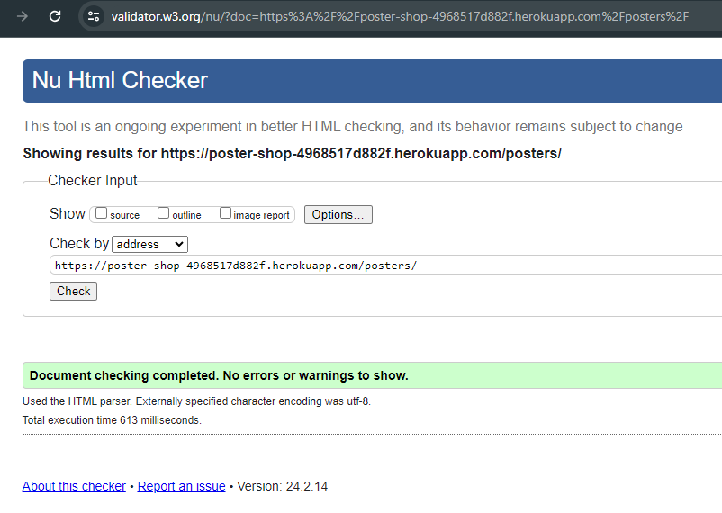 |    |
| Poster detail page | [W3C](https://validator.w3.org/nu/?doc=https%3A%2F%2Fposter-shop-4968517d882f.herokuapp.com%2Fposters%2F2%2F) | 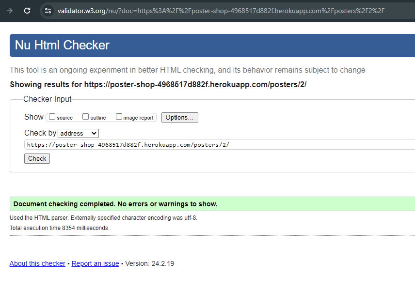 |    |
| Shopping bag page | [W3C](https://validator.w3.org/nu/?doc=https%3A%2F%2Fposter-shop-4968517d882f.herokuapp.com%2Fbag%2F) |  |    |
| Sign up page | [W3C](https://validator.w3.org/nu/?doc=https%3A%2F%2Fposter-shop-4968517d882f.herokuapp.com%2Faccounts%2Fsignup%2F) | 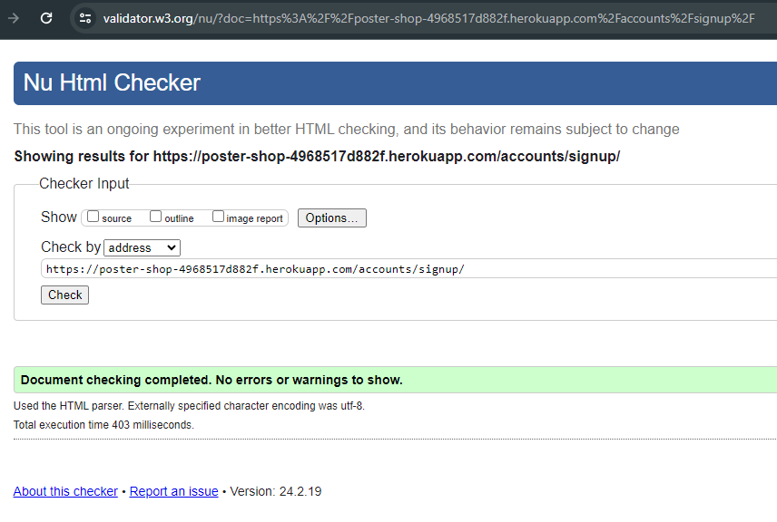 |    |
| Login page | [W3C](https://validator.w3.org/nu/?doc=https%3A%2F%2Fposter-shop-4968517d882f.herokuapp.com%2Faccounts%2Flogin%2F) | 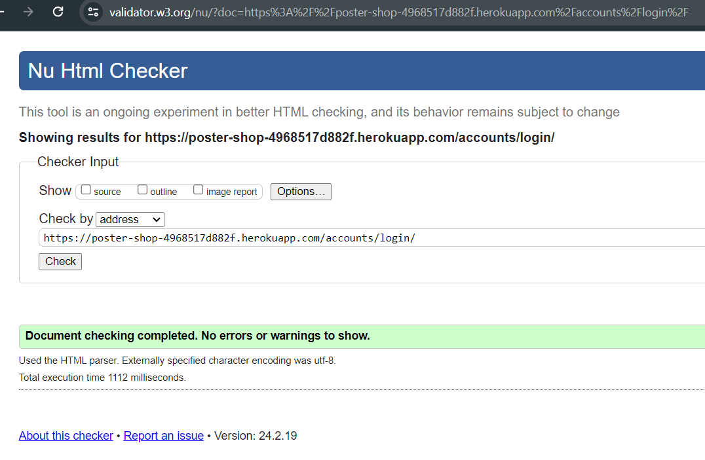 |    |
| Profile page | [W3C](https://validator.w3.org/nu/?doc=https%3A%2F%2Fposter-shop-4968517d882f.herokuapp.com%2Fprofile%2FF) | 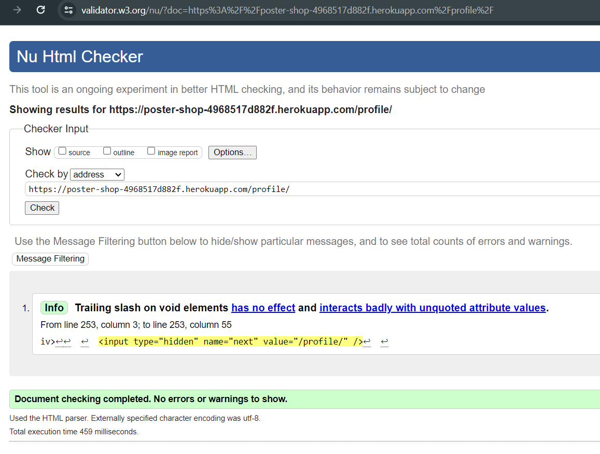 |  No error or warning, just notification about trailing slash on void elements has no effect.  |
| Add poster page | [W3C](https://validator.w3.org/nu/?doc=https%3A%2F%2Fposter-shop-4968517d882f.herokuapp.com%2Fposters%2Fadd%2F) |  |  No error or warning, just notification about trailing slash on void elements has no effect.  |
| Checkout page | [W3C](https://validator.w3.org/nu/?doc=https%3A%2F%2Fposter-shop-4968517d882f.herokuapp.com%2Fcheckout%2F) |  |    |
| Checkout success page | [W3C](https://validator.w3.org/nu/?doc=https%3A%2F%2Fposter-shop-4968517d882f.herokuapp.com%2Fcheckout%2Fcheckout_success) | 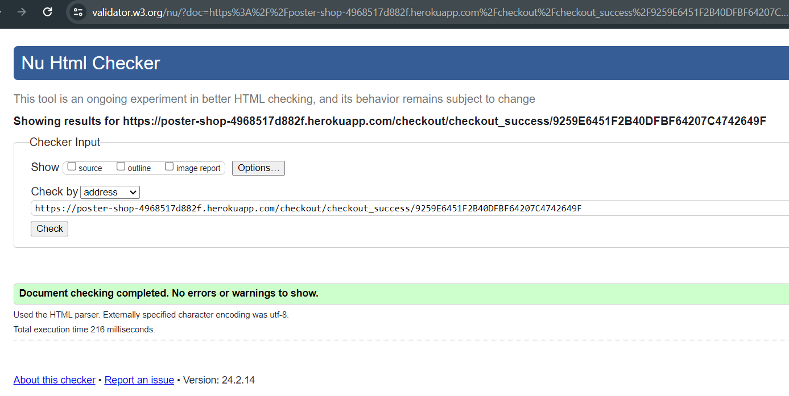 |    |
| Contact page | [W3C](https://validator.w3.org/nu/?doc=https%3A%2F%2Fposter-shop-4968517d882f.herokuapp.com%2Fcontact%2F) | 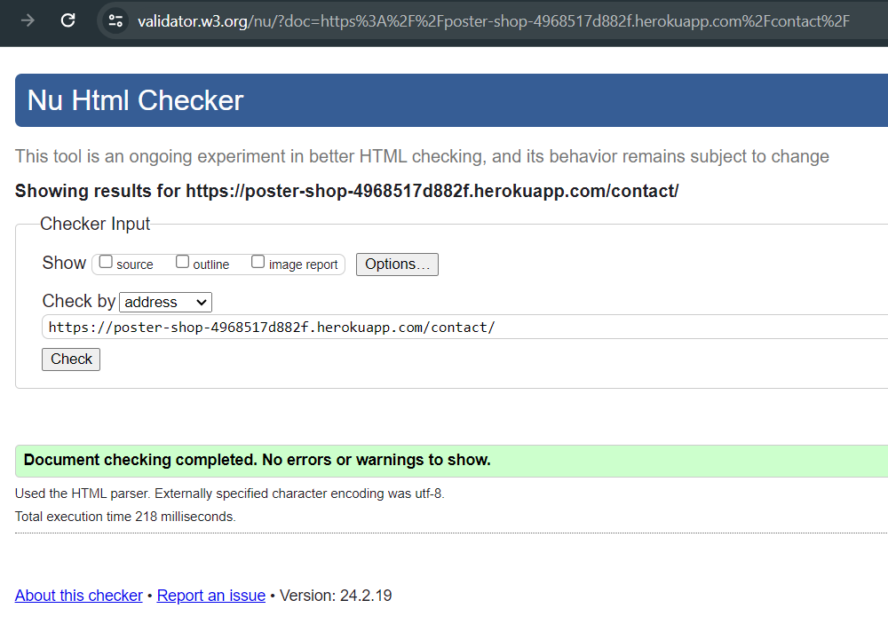 |    |
| Newsletter subscribe page | [W3C](https://validator.w3.org/nu/?doc=https%3A%2F%2Fposter-shop-4968517d882f.herokuapp.com%2Fnewsletters%2F) |  |    |
| About page | [W3C](https://validator.w3.org/nu/?doc=https%3A%2F%2Fposter-shop-4968517d882f.herokuapp.com%2Fabout%2F) | 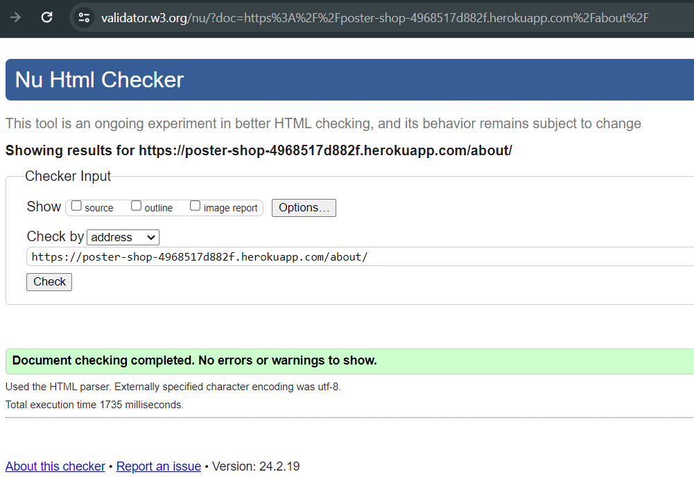 |    |
| Order history page | [W3C](https://validator.w3.org/nu/?doc=https%3A%2F%2Fposter-shop-4968517d882f.herokuapp.com%2Fprofile%2Forder_history%2F282FCCEC776149C5833165520A5B09E5) |  |  |    |

### CSS

The [CSS Jigsaw Validator](https://jigsaw.w3.org/css-validator) was used to validate CSS files for this project.

| Page | Jigsaw URL |  Screenshot | Notes |
| --- | --- | --- | --- |
| base.css | [URL](https://jigsaw.w3.org/css-validator/validator?uri=https%3A%2F%2Fposter-shop.s3.amazonaws.com%2Fstatic%2Fcss%2Fbase.css&profile=css3svg&usermedium=all&warning=1&vextwarning=&lang=en) | 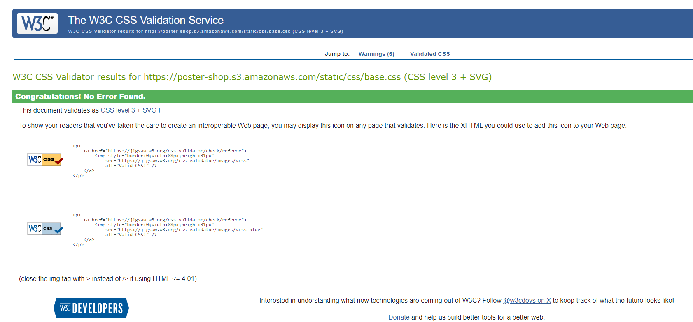 | Six warning related to a vendor extension and same color for background and border |
| checkout.css | [URL](https://jigsaw.w3.org/css-validator/validator?uri=https%3A%2F%2Fposter-shop.s3.amazonaws.com%2Fstatic%2Fcheckout%2Fcss%2Fcheckout.css&profile=css3svg&usermedium=all&warning=1&vextwarning=&lang=en) | 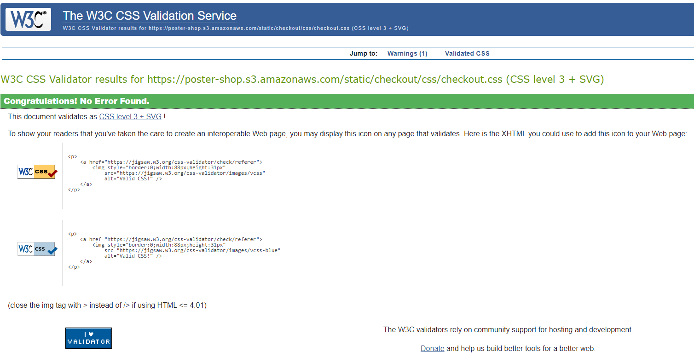 |    |